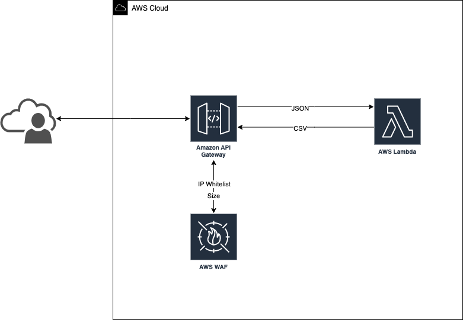

# CDK - API to convert JSON to CSV

## Table of Contents:
* [General Info](#general-information)
* [Technologies Used](#technologies-used)
* [References](#references)
* [Features](#features)
* [Diagram](#diagram)
* [Setup](#setup)
* [Usage](#usage)
* [Project Status](#project-status)
* [Contact](#contact)
* [License](#license)

## General Information:
This is a very simple project just to demonstrate the usage of AWS CDK.

## Technologies Used:
- [AWS CLI](https://docs.aws.amazon.com/cli/latest/userguide/install-cliv2.html) (with credentials set for the account to deploy to)
- [Python 3.10.8](https://www.python.org/downloads/release/python-3108/)
- [PyEnv 3.8.8](https://github.com/pyenv/pyenv)
- [AWS Cloudformation](https://docs.aws.amazon.com/AWSCloudFormation/latest/UserGuide/cfn-whatis-concepts.html)
- nvm v0.39.2
- npm v18.12.1
- cdk 2.62.0

## References:

## Features:
Convert small-size JSON input and return the body in CSV format.

## Diagram:


## Setup:
1.  If you are using the PyCharm IDE, then [configure a new Python interpreter](https://www.jetbrains.com/help/pycharm/configuring-python-interpreter.html) for this project.
2.  Finally, execute the following shell script to install the required Python packages:

```

```

## Usage:

## Project Status:
Project is: _in_progress_

## Contact:
Feel free to contact me:
e-mail: andre.nobre1988@gmail.com

## License
[LICENSE](LICENSE).
